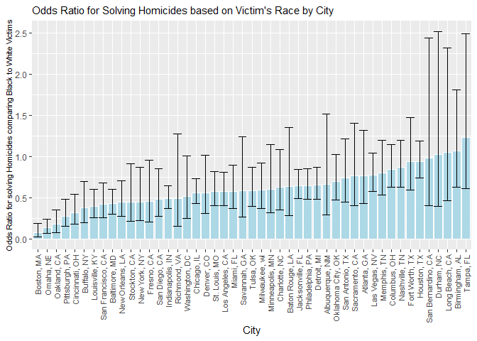
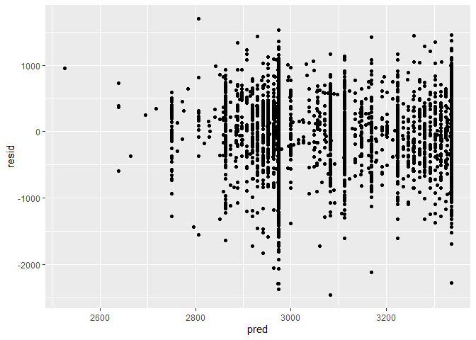
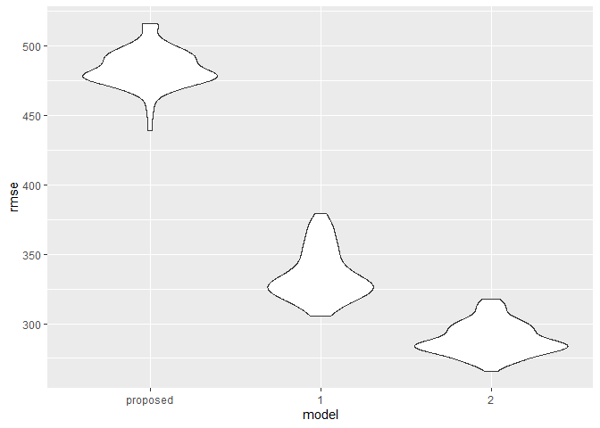

p8105\_hw6\_as6183
================

# Problem 1

``` r
library(tidyverse)
```

    ## -- Attaching packages ----------------------------------------- tidyverse 1.3.0 --

    ## v ggplot2 3.3.2     v purrr   0.3.4
    ## v tibble  3.0.3     v dplyr   1.0.1
    ## v tidyr   1.1.2     v stringr 1.4.0
    ## v readr   1.3.1     v forcats 0.5.0

    ## -- Conflicts -------------------------------------------- tidyverse_conflicts() --
    ## x dplyr::filter() masks stats::filter()
    ## x dplyr::lag()    masks stats::lag()

``` r
data = read.csv("./data/homicide-data.csv")%>%
  mutate(city_state = str_c(city,state,sep=", "),
         solved = ifelse(disposition != "Closed by arrest",0,1))%>%
  filter(city_state != "Dallas, TX" & city_state != "Phoenix, AZ" & city_state != "Kansas City, MO" & city_state != "Tulsa, AL")%>%
  filter(victim_race == "Black" | victim_race == "White")%>%
  mutate(victim_age = as.numeric(victim_age),
         victim_race = fct_relevel(victim_race, "White"))
```

    ## Warning: Problem with `mutate()` input `victim_age`.
    ## x NAs introduced by coercion
    ## i Input `victim_age` is `as.numeric(victim_age)`.

    ## Warning in mask$eval_all_mutate(dots[[i]]): NAs introduced by coercion

``` r
glm_Bmore = data%>%
  filter(city_state == "Baltimore, MD")%>%
  glm(formula = solved~victim_age+victim_sex+victim_race,data = ., family=binomial)

glm_Bmore%>%
   broom::tidy() %>% 
  mutate(OR = exp(estimate)) %>%
  cbind(exp(confint(glm_Bmore)))%>%
  rename(conf.low = `2.5 %`,
         conf.high = `97.5 %`)%>%
  select(term, log_OR = estimate, OR, p.value,conf.low,conf.high)%>% 
  knitr::kable(digits = 3)
```

    ## Waiting for profiling to be done...

|                   | term              | log\_OR |    OR | p.value | conf.low | conf.high |
| :---------------- | :---------------- | ------: | ----: | ------: | -------: | --------: |
| (Intercept)       | (Intercept)       |   1.152 | 3.164 |   0.000 |    1.998 |     5.057 |
| victim\_age       | victim\_age       | \-0.007 | 0.993 |   0.043 |    0.987 |     1.000 |
| victim\_sexMale   | victim\_sexMale   | \-0.854 | 0.426 |   0.000 |    0.324 |     0.558 |
| victim\_raceBlack | victim\_raceBlack | \-0.842 | 0.431 |   0.000 |    0.305 |     0.606 |

``` r
glm_all =
  data %>% 
  nest(data = -city_state) %>% 
  mutate(
    models = map(data, ~ glm(formula = solved~victim_age+victim_sex+victim_race,data = .x, family=binomial)),
    results = map(models, broom::tidy)) %>%
  mutate(map_dfr(.x = models, .f = ~exp(confint(.x,'victim_raceBlack'))))%>% 
  select(-data,-models)%>%
  unnest(results)%>% 
  mutate(OR = exp(estimate)) %>%
  filter(term == "victim_raceBlack")%>%
  rename(conf.low = `2.5 %`,
         conf.high = `97.5 %`)%>%
  select(city_state,term,OR, p.value,conf.low,conf.high) 
```

    ## Waiting for profiling to be done...

    ## Warning: Problem with `mutate()` input `..1`.
    ## x glm.fit: fitted probabilities numerically 0 or 1 occurred
    ## i Input `..1` is `map_dfr(.x = models, .f = ~exp(confint(.x, "victim_raceBlack")))`.

    ## Warning: glm.fit: fitted probabilities numerically 0 or 1 occurred

    ## Waiting for profiling to be done...

    ## Waiting for profiling to be done...
    ## Waiting for profiling to be done...
    ## Waiting for profiling to be done...
    ## Waiting for profiling to be done...
    ## Waiting for profiling to be done...
    ## Waiting for profiling to be done...
    ## Waiting for profiling to be done...
    ## Waiting for profiling to be done...
    ## Waiting for profiling to be done...
    ## Waiting for profiling to be done...
    ## Waiting for profiling to be done...
    ## Waiting for profiling to be done...
    ## Waiting for profiling to be done...
    ## Waiting for profiling to be done...
    ## Waiting for profiling to be done...
    ## Waiting for profiling to be done...
    ## Waiting for profiling to be done...
    ## Waiting for profiling to be done...
    ## Waiting for profiling to be done...
    ## Waiting for profiling to be done...
    ## Waiting for profiling to be done...
    ## Waiting for profiling to be done...
    ## Waiting for profiling to be done...
    ## Waiting for profiling to be done...
    ## Waiting for profiling to be done...
    ## Waiting for profiling to be done...
    ## Waiting for profiling to be done...
    ## Waiting for profiling to be done...
    ## Waiting for profiling to be done...
    ## Waiting for profiling to be done...
    ## Waiting for profiling to be done...
    ## Waiting for profiling to be done...
    ## Waiting for profiling to be done...

    ## Warning: Problem with `mutate()` input `..1`.
    ## x glm.fit: fitted probabilities numerically 0 or 1 occurred
    ## i Input `..1` is `map_dfr(.x = models, .f = ~exp(confint(.x, "victim_raceBlack")))`.
    
    ## Warning: glm.fit: fitted probabilities numerically 0 or 1 occurred

    ## Waiting for profiling to be done...
    ## Waiting for profiling to be done...
    ## Waiting for profiling to be done...

    ## Warning: Problem with `mutate()` input `..1`.
    ## x glm.fit: fitted probabilities numerically 0 or 1 occurred
    ## i Input `..1` is `map_dfr(.x = models, .f = ~exp(confint(.x, "victim_raceBlack")))`.
    
    ## Warning: glm.fit: fitted probabilities numerically 0 or 1 occurred

    ## Waiting for profiling to be done...
    ## Waiting for profiling to be done...
    ## Waiting for profiling to be done...
    ## Waiting for profiling to be done...
    ## Waiting for profiling to be done...
    ## Waiting for profiling to be done...
    ## Waiting for profiling to be done...
    ## Waiting for profiling to be done...
    ## Waiting for profiling to be done...

``` r
glm_all%>%
   ggplot(aes(x = reorder(city_state,OR), y = OR)) +
   geom_bar(stat="identity", fill = "light blue", col = "white")+
   geom_errorbar(aes(ymin = conf.low, ymax = conf.high))+
   xlab("City")+
   ylab("Odds Ratio for solving Homicides comparing Black to White Victims")+
   ggtitle("Odds Ratio for Solving Homicides based on Victim's Race by City")+
   theme(
     axis.text.x = element_text
     (
       size=8,
       angle=90,
       vjust = 0.5, 
       hjust = 1
       ),
     axis.title.y = element_text(size=8),
     plot.title=element_text(size=11)
         )
```

<!-- -->

# Problem 2:

``` r
data = read.csv("./data/birthweight.csv")%>%
  mutate(babysex = factor(babysex),
         frace = factor(frace),
         malform = factor(malform),
         mrace = factor(mrace),
         fincome = factor(fincome))
```

Proposed Regression Model:

``` r
library(modelr)
```

    ## Warning: package 'modelr' was built under R version 4.0.3

``` r
proposed_model = lm(bwt~frace+malform+mrace+smoken,data = data)

proposed_model%>% 
  broom::tidy() %>% 
  select(term, estimate, p.value)%>%
  knitr::kable(digits=3)
```

| term        |  estimate | p.value |
| :---------- | --------: | ------: |
| (Intercept) |  3335.871 |   0.000 |
| frace2      |  \-78.961 |   0.332 |
| frace3      |  \-29.257 |   0.811 |
| frace4      |  \-80.202 |   0.310 |
| frace8      |   \-2.281 |   0.986 |
| malform1    |  \-20.422 |   0.870 |
| mrace2      | \-282.153 |   0.001 |
| mrace3      | \-158.533 |   0.211 |
| mrace4      | \-173.247 |   0.029 |
| smoken      |  \-11.201 |   0.000 |

``` r
data%>%
  modelr::add_residuals(proposed_model)%>%
  modelr::add_predictions(proposed_model)%>%
  ggplot(aes(pred,resid))+geom_point()
```

<!-- -->

**Description of Modeling Process and Graph:**

``` r
cv_df = 
  crossv_mc(data, 100)%>% 
  mutate(
    train = map(train, as_tibble),
    test = map(test, as_tibble))

cv_df = 
  cv_df %>% 
  mutate(
    proposed_model  = map(train, ~lm(bwt~frace+malform+mrace+smoken,data = .x)),
    model_1  = map(train, ~lm(bwt~gaweeks+blength,data = .x)),
    model_2  = map(train, ~lm(bwt~bhead*blength+blength*babysex+bhead*babysex+bhead*babysex*blength,data = .x))) %>% 
  mutate(
    rmse_proposed = map2_dbl(proposed_model, test, ~rmse(model = .x, data = .y)),
    rmse_1 = map2_dbl(model_1, test, ~rmse(model = .x, data = .y)),
    rmse_2 = map2_dbl(model_2, test, ~rmse(model = .x, data = .y)))

cv_df %>% 
  select(starts_with("rmse")) %>% 
  pivot_longer(
    everything(),
    names_to = "model", 
    values_to = "rmse",
    names_prefix = "rmse_") %>% 
  mutate(model = fct_inorder(model)) %>% 
  ggplot(aes(x = model, y = rmse)) + geom_violin()
```

<!-- -->
