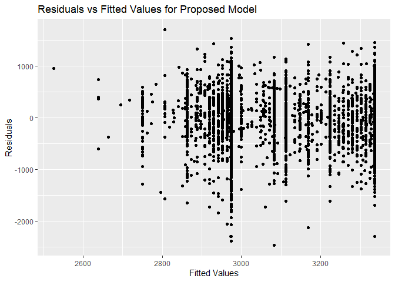

p8105\_hw6\_as6183
================

# Problem 1

``` r
library(tidyverse)
#reading in homicide data, perfoming data wrangling and cleaning
data = read.csv("./data/homicide-data.csv")%>% 
  mutate(city_state = str_c(city,state,sep=", "), 
         solved = ifelse(disposition != "Closed by arrest",0,1))%>% 
  filter(city_state != "Dallas, TX" & city_state != "Phoenix, AZ" & city_state != "Kansas City, MO" & city_state != "Tulsa, AL")%>%
  filter(victim_race == "Black" | victim_race == "White")%>%
  mutate(victim_age = as.numeric(victim_age),
         victim_race = fct_relevel(victim_race, "White"))

#glm only for baltimore

glm_Bmore = data%>%
  filter(city_state == "Baltimore, MD")%>%
  glm(formula = solved~victim_age+victim_sex+victim_race,data = ., family=binomial)

glm_Bmore%>%
   broom::tidy() %>% 
  mutate(OR = exp(estimate)) %>%
  cbind(exp(confint(glm_Bmore)))%>%
  rename(conf.low = `2.5 %`,
         conf.high = `97.5 %`)%>%
  select(term, log_OR = estimate, OR, p.value,conf.low,conf.high)%>% 
  knitr::kable(digits = 3)
```

|                   | term              | log\_OR |    OR | p.value | conf.low | conf.high |
| :---------------- | :---------------- | ------: | ----: | ------: | -------: | --------: |
| (Intercept)       | (Intercept)       |   1.152 | 3.164 |   0.000 |    1.998 |     5.057 |
| victim\_age       | victim\_age       | \-0.007 | 0.993 |   0.043 |    0.987 |     1.000 |
| victim\_sexMale   | victim\_sexMale   | \-0.854 | 0.426 |   0.000 |    0.324 |     0.558 |
| victim\_raceBlack | victim\_raceBlack | \-0.842 | 0.431 |   0.000 |    0.305 |     0.606 |

``` r
#Glm for all cities in data set

glm_all =
  data %>% 
  nest(data = -city_state) %>% 
  mutate(
    models = map(data, ~ glm(formula = solved~victim_age+victim_sex+victim_race,data = .x, family=binomial)),
    results = map(models, broom::tidy)) %>%
  mutate(map_dfr(.x = models, .f = ~exp(confint(.x,'victim_raceBlack'))))%>% 
  select(-data,-models)%>%
  unnest(results)%>% 
  mutate(OR = exp(estimate)) %>%
  filter(term == "victim_raceBlack")%>%
  rename(conf.low = `2.5 %`,
         conf.high = `97.5 %`)%>%
  select(city_state,term,OR, p.value,conf.low,conf.high) 

#plotting the distribution of OR values calculated from Glm model above

glm_all%>%
   ggplot(aes(x = reorder(city_state,OR), y = OR)) +
   geom_bar(stat="identity", fill = "light blue", col = "white")+
   geom_errorbar(aes(ymin = conf.low, ymax = conf.high))+
   xlab("City")+
   ylab("Odds Ratio for solving Homicides comparing Black to White Victims")+
   ggtitle("Odds Ratio for Solving Homicides based on Victim's Race by City")+
   theme(
     axis.text.x = element_text
     (
       size=8,
       angle=90,
       vjust = 0.5, 
       hjust = 1
       ),
     axis.title.y = element_text(size=8),
     plot.title=element_text(size=11)
         )
```

<!-- -->

**Comments on Odd Ratio Plot:**

This plot shows the distribution of odd ratio by US Cities when
comparing solving homicide cases when the victim is black to solving
homicide cases when the victim is white. I found it very interesting
that most cities have an Odds Ratio estimate of less than 1 which means
that homicides where the victim is Black are solved with less frequency
when compared to homicides where the victim is White. I also found it
interesting that for cities that do have an Odds Ratio estimate above 1,
the confidence interval is much larger and the interval contains numbers
below 1 which indicates that the true Odds Ratio could be less than 1.
This could be due to some of the cities that have a higher Odds Ratio
such as Tampa, FL and Long Beach, CA having lower entries when compared
to cities that have lower Odds Ratios such as Chicago, IL or Boston, MA.

# Problem 2:

``` r
#reading and cleaning birthweight data 

data = read.csv("./data/birthweight.csv")%>%
  mutate(babysex = factor(babysex),
         frace = factor(frace),
         malform = factor(malform),
         mrace = factor(mrace),
         fincome = factor(fincome))
```

Proposed Regression Model:

``` r
library(modelr)

proposed_model = lm(bwt~frace+malform+mrace+smoken,data = data) #proposed model for determining birthweight

proposed_model%>% 
  broom::tidy() %>% 
  select(term, estimate, p.value)%>%
  knitr::kable(digits=3)
```

| term        |  estimate | p.value |
| :---------- | --------: | ------: |
| (Intercept) |  3335.871 |   0.000 |
| frace2      |  \-78.961 |   0.332 |
| frace3      |  \-29.257 |   0.811 |
| frace4      |  \-80.202 |   0.310 |
| frace8      |   \-2.281 |   0.986 |
| malform1    |  \-20.422 |   0.870 |
| mrace2      | \-282.153 |   0.001 |
| mrace3      | \-158.533 |   0.211 |
| mrace4      | \-173.247 |   0.029 |
| smoken      |  \-11.201 |   0.000 |

``` r
data%>%
  modelr::add_residuals(proposed_model)%>%
  modelr::add_predictions(proposed_model)%>%
  ggplot(aes(pred,resid))+
  geom_point()+
  labs(x = "Fitted Values", y= "Residuals", title = "Residuals vs Fitted Values for Proposed Model")#adding residuals and predictions to model and graphing
```

<!-- -->

**Description of Modeling Process:**

For the modeling process I wanted to adjust for variables that I thought
would be important indicators of the baby’s birthweight. The variables I
chose to adjust for were father/mother’s race because I know that baby’s
weight can vary drastically depending on their race
[\[1\]](https://www.nature.com/articles/7210703#:~:text=Asian%2C%20Hispanic%20and%20Other%20male,weights%20than%20White%20female%20infants),
the presence of malformations that could affect weight because it says
it could affect weight in the problem, and finally the average number of
cigarettes smoked per day by the mother as that has been shown to affect
the baby’s health in numerous studies
[\[2\]](https://www.sciencedirect.com/science/article/abs/pii/S0002937816331374?via%3Dihub).

``` r
#seperating data into partitions for testing each model to determine optimal one

cv_df = 
  crossv_mc(data, 100)%>% 
  mutate(
    train = map(train, as_tibble),
    test = map(test, as_tibble))

#calculating rmse for each model to compare them

cv_df = 
  cv_df %>% 
  mutate(
    proposed_model  = map(train, ~lm(bwt~frace+malform+mrace+smoken,data = .x)),
    model_1  = map(train, ~lm(bwt~gaweeks+blength,data = .x)),
    model_2  = map(train, ~lm(bwt~bhead*blength*babysex,data = .x))) %>% 
  mutate(
    rmse_proposed = map2_dbl(proposed_model, test, ~rmse(model = .x, data = .y)),
    rmse_1 = map2_dbl(model_1, test, ~rmse(model = .x, data = .y)),
    rmse_2 = map2_dbl(model_2, test, ~rmse(model = .x, data = .y)))

#plotting rmse values for each model using a violin plot

cv_df %>% 
  select(starts_with("rmse")) %>% 
  pivot_longer(
    everything(),
    names_to = "model", 
    values_to = "rmse",
    names_prefix = "rmse_") %>% 
  mutate(model = fct_inorder(model)) %>% 
  ggplot(aes(x = model, y = rmse)) + geom_violin()
```

<!-- -->

**Comments on Comparison of Models:**

From the violin plot above we can see that my proposed model has a much
larger error when compared to model 1 (using length at birth and
gestational age as predictors) and model 2 (using head circumference,
length, sex, and all interactions as predictors). The best model
according to error is model 2 which has the lowest error of the three
models.

# Problem 3:

``` r
library(rnoaa)

#reading in data and cleaning

weather_df = 
  rnoaa::meteo_pull_monitors(
    c("USW00094728"),
    var = c("PRCP", "TMIN", "TMAX"), 
    date_min = "2017-01-01",
    date_max = "2017-12-31") %>%
  mutate(
    name = recode(id, USW00094728 = "CentralPark_NY"),
    tmin = tmin / 10,
    tmax = tmax / 10) %>%
  select(name, id, everything())

#setting up bootstrap samples to generate r.squared and log(B0B1) values

boot_sample = function(df) {
  sample_frac(df, replace = TRUE)
}

boot_straps = 
  data_frame(
    strap_number = 1:5000,
    strap_sample = rerun(5000, boot_sample(weather_df))
  )

#runnning bootstrap samples through model and extracting r.squared and log(B0B1) values 

bootstrap_results = 
  boot_straps %>% 
  mutate(
    models = map(strap_sample, ~lm(tmax ~ tmin, data = .x) ),
    r2 = map(models,broom::glance),
    results = map(models, broom::tidy)) %>% 
  select(-strap_sample, -models) %>% 
  unnest(results)%>%
  select(-c(p.value,statistic,std.error))%>%
  unnest(r2)%>%
  select(strap_number,term,estimate,r.squared)%>%
  pivot_wider(names_from = term, values_from = estimate)%>%
  mutate(log = log(`(Intercept)`*tmin))

library(patchwork)

# plotting distribution of r.squared (plot 1) and log(B0B1) [plot 2] values

plot_1 = bootstrap_results%>%
   ggplot(aes(x = r.squared)) + 
  geom_density()+
  xlab("r.squared")+
  ylab("density")+
  xlim(c(0.87,0.96))+
  ggtitle("Distribution of R squared values")

plot_2 = bootstrap_results%>%
  ggplot(aes(x = log)) + 
  geom_density()+
  xlab("log(B0*B1)")+
  ylab("density")+
  ggtitle("Distribution of log(B0*B1) values")

plot_1 + plot_2
```

<!-- -->

**Explanation of R squared and log(B0B1) Results:**

The distribution of values for R squared ranges from 0.877 to 0.939 and
looks normally distributed. The distribution of values for log(B0B1)
ranges from 1.915 to 2.096 and also looks approximately normally
distributed.

**Calculating Confidence Intervals:**

``` r
#calculating confidence interval for r.squared
confidence_r2 = bootstrap_results%>%
  summarize(
    ci_lower = quantile(r.squared,0.025), 
    ci_upper = quantile(r.squared,0.975))

#calculating confidence interval for log(B0B1)
confidence_log = bootstrap_results%>%
  summarize(
    ci_lower = quantile(log,0.025), 
    ci_upper = quantile(log,0.975))

confidence_r2%>%
  knitr::kable(caption = "95% Confidence Interval for R Squared", format = "html", digits = 3)
```

<table>

<caption>

95% Confidence Interval for R Squared

</caption>

<thead>

<tr>

<th style="text-align:right;">

ci\_lower

</th>

<th style="text-align:right;">

ci\_upper

</th>

</tr>

</thead>

<tbody>

<tr>

<td style="text-align:right;">

0.894

</td>

<td style="text-align:right;">

0.927

</td>

</tr>

</tbody>

</table>

``` r
confidence_log%>%
  knitr::kable(caption = "95% Confidence Interval for log(B0*B1)", format = 'html', digits = 3)
```

<table>

<caption>

95% Confidence Interval for log(B0\*B1)

</caption>

<thead>

<tr>

<th style="text-align:right;">

ci\_lower

</th>

<th style="text-align:right;">

ci\_upper

</th>

</tr>

</thead>

<tbody>

<tr>

<td style="text-align:right;">

1.965

</td>

<td style="text-align:right;">

2.058

</td>

</tr>

</tbody>

</table>
